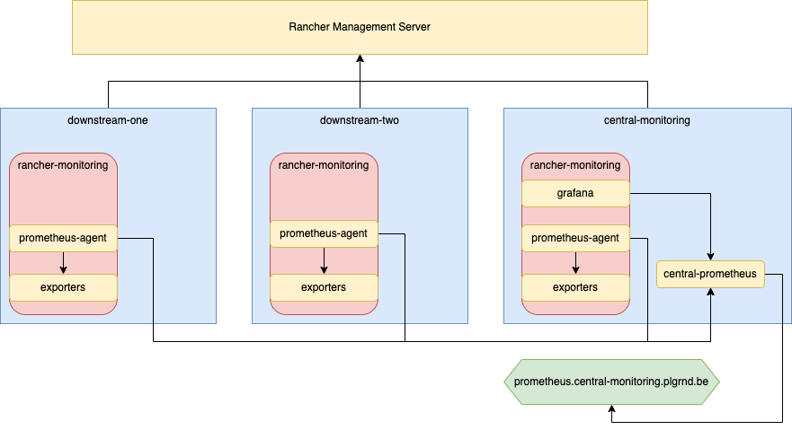
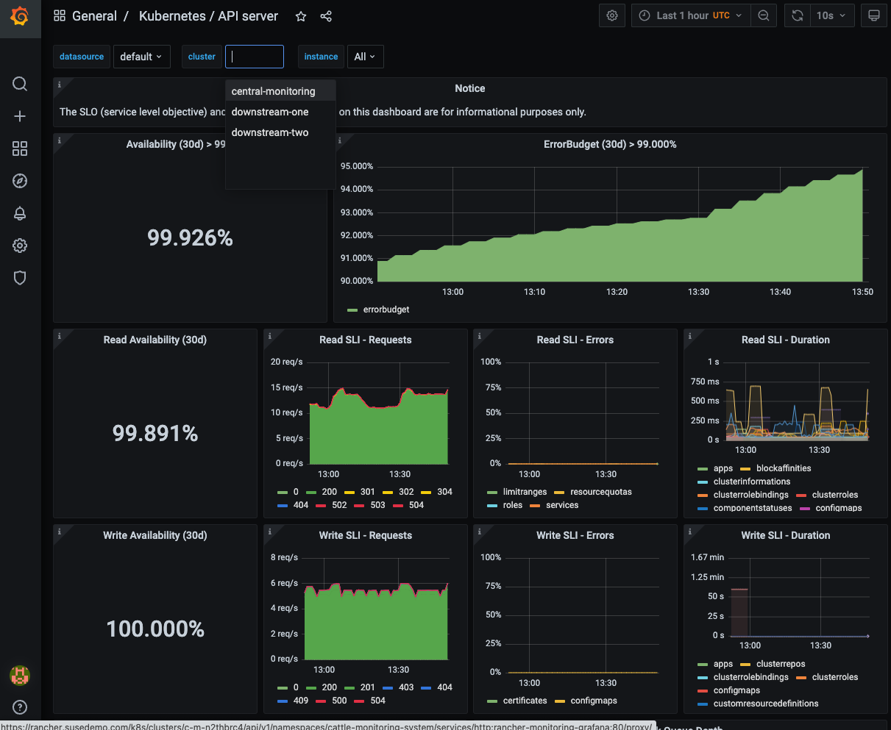

# Multi-Cluster Monitoring with Prometheus Remote Write

There are multiple ways how you can set up Rancher Monitoring to combine metrics of multiple clusters:

* Using Prometheus Federation so that a central Prometheus fetches metrics from the downstream Prometheus federation endpoints
* Using Prometheus remote write, so that downstream Prometheus instances push their metrics to a central Prometheus
* Using a Prometheus agent in each downstream cluster to push metrics to a central Prometheus instance
* Using Thanos to combine metrics of multiple Prometheus instances inside a Thanos object store

This walk-through explains the Prometheus agent approach

## Prerequisites

You'll need three Kubernetes clusters:

* downstream-one
* downstream-two
* central-monitoring

The central-monitoring cluster must have an ingress controller installed, ideally with a load-balancer in front and a DNS entry for the cluster's Prometheus pointing to the load-balancer/ingress-controller. To secure the traffic, we will use Let's Encrypt TLS certificates.

The following diagram illustrates the final architecture:



The [terraform-setup](./terraform-setup) example shows, how to set this up in AWS and an existing Rancher Management Server.

## Installing cert-manager into each cluster

In order to use Let's Encrypt TLS certificates, we have to install cert-manager into the central-monitoring cluster:

```shell
helm repo add jetstack https://charts.jetstack.io

helm install \
  cert-manager jetstack/cert-manager \
  --namespace cert-manager \
  --create-namespace \
  --version v1.11.0 \
  --set installCRDs=true
```

and create a ClusterIssuer configuration that instructs cert-manager to use Let's Encrypt http challenges to proof that we control the domain:

```shell
kubectl apply -f 00-cluster-issuer.yaml
```

## Installing Central Rancher Monitoring

First install the Rancher Monitoring CRDs and create a secret with basic auth credentials in the central monitoring cluster

```shell
helm repo add rancher-charts https://charts.rancher.io

helm install --namespace cattle-monitoring-system rancher-monitoring-crd rancher-charts/rancher-monitoring-crd --create-namespace --wait

kubectl apply -f 02-basic-auth-secret.yaml 
```

Next install Rancher Monitoring itself, this will create a local Prometheus in the central monitoring cluster to scrape the metrics of the local cluster. The results will be posed into an additional Prometheus that will get data from all clusters.

```shell
helm install --namespace cattle-monitoring-system rancher-monitoring rancher-charts/rancher-monitoring --create-namespace -f 01-rancher-monitoring-values-central-monitoring.yaml
```

After the local Rancher Monitoring instance has been created, we can Prometheus instance to store all metrics in. This is also exposed with an Ingress and HTTP basic auth. The Grafana from Rancher Monitoring is already configured to have this central Prometheus as a datasource.

```shell
kubectl create namespace central-monitoring-system
kubectl apply -f 03-central-prometheus.yaml
```

## Installing Monitoring in downstream clusters

Now the downstream clusters need a Prometheus agent and the necessary exporters deployed. Since the necessary Helm chart changes to allow the Prometheus agent mode are not present in the Rancher Monitoring chart yet, we will deploy a minimal upstream version of the kube-prometheus-stack-chart.

For the downstream-one cluster

```shell
helm repo add prometheus-community https://prometheus-community.github.io/helm-charts

helm upgrade --install --namespace cattle-monitoring-system rancher-monitoring prometheus-community/kube-prometheus-stack --create-namespace -f 01-rancher-monitoring-values-downstream.yaml --set prometheus.prometheusSpec.externalLabels.cluster=downstream-one
kubectl apply -f 02-basic-auth-secret.yaml 
```

For the downstream-two cluster

```shell
helm repo add prometheus-community https://prometheus-community.github.io/helm-charts

helm upgrade --install --namespace cattle-monitoring-system rancher-monitoring prometheus-community/kube-prometheus-stack --create-namespace -f 01-rancher-monitoring-values-downstream.yaml --set prometheus.prometheusSpec.externalLabels.cluster=downstream-two
kubectl apply -f 02-basic-auth-secret.yaml 
```

# Accessing Grafana

After Prometheus is up and running, navigate to the central monitoring cluster and access Grafana from the Monitoring section. This Grafana now connects to the central-monitoring Prometheus, which contains metrics from all clusters. And all the dashboards have an additional cluster filter:


